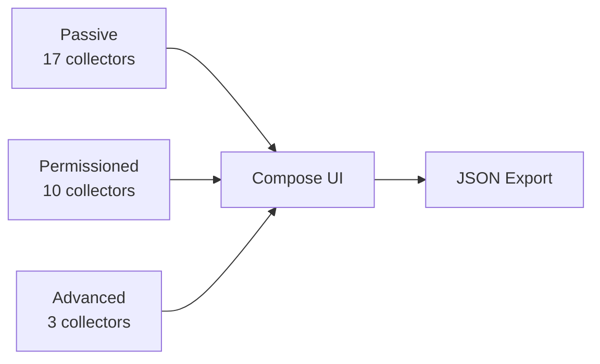

# AndroWatch

<p align="center">
  <strong>See what your Android device reveals — and why it matters for fingerprinting.</strong>
</p>

<p align="center">
  <a href="LICENSE"></a>
  <a href="https://github.com/LTechnologies0/AndroWatch/actions/workflows/ci.yml"></a>
  <a href="https://github.com/LTechnologies0/AndroWatch/releases"></a>
  <a href="https://ltechnologies0.github.io/AndroWatch/"></a>
  
  
</p>

**AndroWatch** is an open-source Android privacy audit app inspired by [Loupe](https://github.com/mysk-research/loupe). It collects **on-device fingerprint signals** through public Android APIs, groups them by access cost, and explains **why each reading can contribute to tracking**.

> All data stays on your phone unless **you** explicitly export a JSON report.

---

## Table of contents

- [Features](#features)
- [Signal tiers](#signal-tiers)
- [Architecture](#architecture)
- [Install from GitHub Releases](#install-from-github-releases)
- [Build it yourself](#build-it-yourself)
- [API documentation (KDoc)](#api-documentation-kdoc)
- [Security](#security)
- [Contributing](#contributing)
- [License](#license)

---

## Features

| Feature | Description |
|---------|-------------|
| **30 signal categories** | Device identity, network, sensors, apps, WebView canvas/WebGL, and more |
| **3 sensitivity tiers** | Passive · Permissioned · Advanced |
| **Privacy rationales** | Every signal includes a short explanation of fingerprinting relevance |
| **Runtime permission gates** | Dangerous permissions requested only when you open a category |
| **Live collectors** | Battery, motion, and audio route update in real time |
| **JSON export** | Share a structured report via Android share sheet (`FileProvider`) |
| **Material 3 UI** | Jetpack Compose, dynamic color, edge-to-edge |
| **i18n** | Extensive `values-*` string resources |
| **Release hardening** | R8 minify, resource shrink, privacy-safe logging |

### Signal categories (30)

<details>
<summary><strong>Passive (17)</strong> — no dangerous permissions</summary>

`DeviceIdentity` · `GoogleAccount` · `SystemInfo` · `Display` · `Locale` · `Accessibility` · `DeviceMotion` · `Battery` · `Storage` · `Network` · `Fonts` · `InstalledVoices` · `AppInfo` · `Pasteboard` · `Audio` · `Graphics` · `Telephony`

</details>

<details>
<summary><strong>Permissioned (10)</strong> — runtime permission required</summary>

`Motion` · `Location` · `Cameras` · `Bluetooth` · `LocalNetwork` · `Contacts` · `Photos` · `Calendar` · `Reminders` · `MusicLibrary`

</details>

<details>
<summary><strong>Advanced (3)</strong> — side-channels / on-demand probes</summary>

`InstalledAppsProbe` · `WebViewFingerprint` · `PreviousInstallsLog`

</details>

Full API mapping: [docs/ANDROID_API_MAP.md](docs/ANDROID_API_MAP.md)

---

## Signal tiers



| Tier | Runtime prompt | Examples |
|------|------------------|----------|
| **Passive** | None | `Build.*`, `Settings`, `ConnectivityManager` |
| **Permissioned** | Per category | Location, camera, contacts, Bluetooth scan |
| **Advanced** | On-demand / side-channel | WebView canvas hash, URI scheme app probing |

---

## Architecture

10-module Gradle project — dependencies flow **downward only**:

```
:app
 ├── :collector:assembly → tier-passive / tier-permissioned / tier-advanced
 │                         └── :collector:engine → :collector:contract
 ├── :feature:export
 └── :core:model, :core:permission
```

See [docs/ARCHITECTURE.md](docs/ARCHITECTURE.md) for the full module graph and data flow.

| Module | Role |
|--------|------|
| `:app` | Compose shell, `CategoryViewModel`, navigation |
| `:core:model` | `FingerprintSignal`, `SignalCategory`, `Sensitivity` |
| `:core:permission` | `PermissionCenter` — category → permission mapping |
| `:collector:contract` | `SignalCollector` / `LiveSignalCollector` interfaces |
| `:collector:engine` | Probes, interpreters, WebView/GLES/mDNS helpers |
| `:collector:tier-*` | 30 category collectors |
| `:collector:assembly` | `CollectorRegistry` wiring |
| `:feature:export` | `ReportExporter` JSON + share intent |

---

## Install from GitHub Releases

1. Open **[Releases](https://github.com/LTechnologies0/AndroWatch/releases)**.
2. Download the APK matching your device CPU:

| APK suffix | Device |
|------------|--------|
| `arm64-v8a` | Most phones & tablets (2017+) |
| `armeabi-v7a` | Older 32-bit ARM |
| `x86_64` | Emulators / some Chromebooks |
| `x86` | Older 32-bit emulators |

3. Enable **Install unknown apps** for your browser/files app.
4. Install the APK.

```bash
# Or via ADB (replace ABI and version)
adb install AndroWatch-0.1.0-arm64-v8a-release.apk
```

---

## Build it yourself

### Prerequisites

| Tool | Version |
|------|---------|
| JDK | 17+ (Temurin recommended) |
| Android SDK | API 37 (`platforms;android-37`, `build-tools;36.x`) |
| `adb` | For device install (platform-tools) |

Copy `local.properties.example` → `local.properties` and set `sdk.dir`, **or** set `ANDROID_HOME`.

### One-shot commands

#### Linux / macOS

```bash
git clone https://github.com/LTechnologies0/AndroWatch.git
cd AndroWatch
cp local.properties.example local.properties   # edit sdk.dir

# Debug APK (single ABI — fast)
./gradlew :app:assembleDebug

# Run unit tests
./gradlew test

# Install on connected device
./gradlew installToPhone
# or
adb install -r app/build/outputs/apk/debug/app-arm64-v8a-debug.apk

# Release APKs (all 4 ABIs, signed if keystore present)
./scripts/generate-release-keystore.sh   # first time only
./gradlew :app:assembleRelease
```

#### Windows (PowerShell)

```powershell
git clone https://github.com/LTechnologies0/AndroWatch.git
cd AndroWatch
Copy-Item local.properties.example local.properties   # edit sdk.dir

.\gradlew.bat :app:assembleDebug
.\gradlew.bat test
.\gradlew.bat installToPhone
```

#### Fedora / Bazzite (USB debugging)

```bash
# udev rules for ADB (once, requires sudo)
sudo ./scripts/setup-udev.sh 2>/dev/null || true

adb devices
./gradlew installToPhone
```

### Build variants

| Command | Output |
|---------|--------|
| `assembleDebug` | 1 APK (`arm64-v8a` by default) |
| `assembleDebug -Ponionphone.devAbi=x86_64` | Debug for emulator |
| `assembleRelease` | 4 signed APKs (one per ABI) |
| `dokkaGenerate` | HTML API docs in `build/dokka/html/` |

### Local release signing

```bash
./scripts/generate-release-keystore.sh
# Creates release.keystore + keystore.properties (both gitignored)
./gradlew :app:assembleRelease
```

Never commit `keystore.properties`, `*.keystore`, or `local.properties`.

---

## API documentation (KDoc)

All public APIs are documented with **KDoc** in source. HTML reference is generated with **[Dokka](https://kotlinlang.org/docs/dokka-introduction.html)**:

```bash
./gradlew dokkaGenerate
# → build/dokka/html/index.html
```

Published automatically to **GitHub Pages** on every push to `main`:

**https://ltechnologies0.github.io/AndroWatch/**

(workflow: `.github/workflows/docs.yml`)

---

## Security

- **Local-first**: no network upload of fingerprint data
- **No hardcoded secrets**: signing via `keystore.properties` (gitignored) or CI secrets
- **Release stripping**: verbose collector logs removed by R8 (`gradle/privacy-logging.pro`)
- **Backup disabled** in manifest

See [SECURITY.md](SECURITY.md) for vulnerability reporting.

### CI secrets (maintainers)

| GitHub Secret | Purpose |
|---------------|---------|
| `RELEASE_KEYSTORE_BASE64` | Base64-encoded `.keystore` file |
| `RELEASE_KEYSTORE_PASSWORD` | Keystore password |
| `RELEASE_KEY_ALIAS` | Key alias (`androwatch`) |
| `RELEASE_KEY_PASSWORD` | Key password |

Generate values with `./scripts/generate-release-keystore.sh`.

---

## GitHub automation

| Workflow | Trigger | Purpose |
|----------|---------|---------|
| [CI](.github/workflows/ci.yml) | Push / PR | Unit tests, debug APK artifact, CodeQL |
| [Release](.github/workflows/release.yml) | Tag `v*.*.*` | Signed multi-ABI APKs → GitHub Release |
| [Docs](.github/workflows/docs.yml) | Push to `main` | Dokka → GitHub Pages |
| [Dependency Review](.github/workflows/dependency-review.yml) | Pull requests | OWASP dependency diff on PRs |
| [OpenSSF Scorecard](.github/workflows/scorecard.yml) | Weekly + push | Supply-chain security score |
| [Dependabot](.github/dependabot.yml) | Weekly | Gradle + Actions updates |

---

## Contributing

1. Fork the repository
2. Create a feature branch
3. Run `./gradlew test :app:assembleDebug`
4. Add KDoc for new public APIs
5. Open a pull request

---

## Android vs iOS (Loupe parity notes)

| Topic | Android (AndroWatch) | iOS (Loupe) |
|-------|---------------------|-------------|
| App probing | Package visibility limits (API 30+) | Broader enumeration |
| Device ID | `ANDROID_ID` (scoped) | `identifierForVendor` |
| Install persistence | `EncryptedSharedPreferences` probe | Keychain-based |

---

## License

[MIT](LICENSE) © 2026 AndroWatch contributors

---

<p align="center">
  <sub>Inspired by <a href="https://github.com/mysk-research/loupe">Loupe</a> · Built with Kotlin & Jetpack Compose</sub>
</p>
