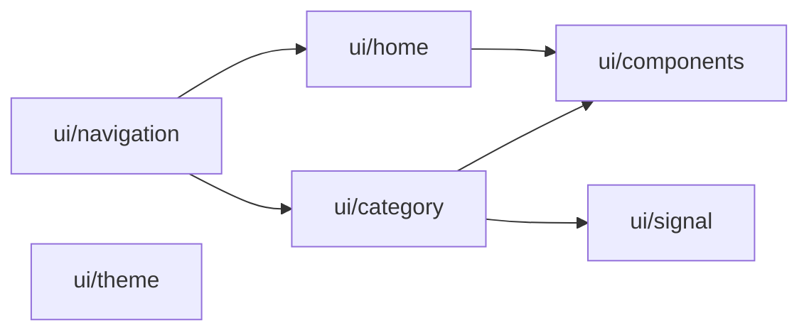
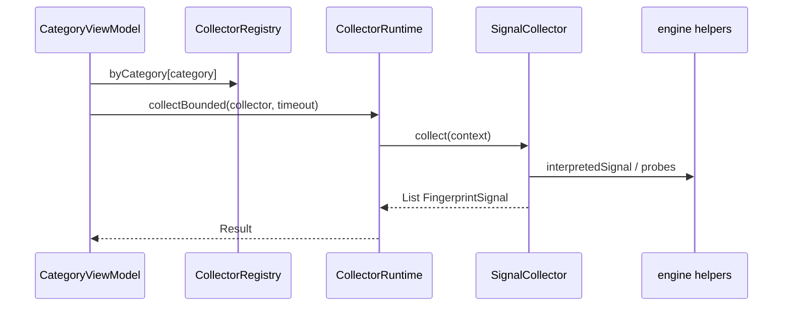

# AndroWatch — Module graph

Gradle multi-module layout. Dependencies flow **downward only** (app → features → collector assembly → tiers → engine → contract → core).

```mermaid
flowchart TB
    subgraph app_layer["`:app` — Shell"]
        APP[MainActivity · NavGraph · Compose UI]
        PRES[presentation/CategoryViewModel]
        DATA[data/UserPreferences]
        NARR[narrative/FingerprintNarrative]
    end

    subgraph feature_layer["`:feature:*`"]
        EXP[`:feature:export` ReportExporter]
    end

    subgraph collector_layer["`:collector:*` — Fingerprint pipeline"]
        ASM[`:collector:assembly` CollectorRegistry]
        TP[`:collector:tier-passive` 17 collectors]
        TPR[`:collector:tier-permissioned` 10 collectors]
        TA[`:collector:tier-advanced` 3 collectors]
        ENG[`:collector:engine` Runtime · Interpreter · Probes]
        CTR[`:collector:contract` SignalCollector]
    end

    subgraph core_layer["`:core:*` — Domain"]
        MDL[`:core:model` FingerprintSignal · SignalCategory]
        PERM[`:core:permission` PermissionCenter]
    end

    APP --> ASM
    APP --> EXP
    APP --> MDL
    APP --> PERM
    PRES --> ASM
    PRES --> EXP
    EXP --> MDL
    ASM --> TP
    ASM --> TPR
    ASM --> TA
    TP --> ENG
    TPR --> ENG
    TA --> ENG
    ENG --> CTR
    CTR --> MDL
    MDL --> PERM
```

## Module responsibilities

| Module | Role | Key packages |
|--------|------|----------------|
| **`:core:model`** | Domain types, serialization | `ltechnologies.onionphone.androwatch.model` |
| **`:core:permission`** | Runtime permission mapping | `ltechnologies.onionphone.androwatch.permission` |
| **`:collector:contract`** | Collector interfaces | `ltechnologies.onionphone.androwatch.collector` |
| **`:collector:engine`** | Runtime guards, interpretation, ROM, GLES/WebView/TTS probes | `ltechnologies.onionphone.androwatch.collector` |
| **`:collector:tier-passive`** | Tier 1 — no runtime prompt (17 categories) | `ltechnologies.onionphone.androwatch.collector.passive` |
| **`:collector:tier-permissioned`** | Tier 2 — dangerous permissions (10) | `ltechnologies.onionphone.androwatch.collector.permissioned` |
| **`:collector:tier-advanced`** | Tier 3 — side-channels (3) | `ltechnologies.onionphone.androwatch.collector.advanced` |
| **`:collector:assembly`** | Wires all collectors into `CollectorRegistry` | `ltechnologies.onionphone.androwatch.collector` |
| **`:feature:export`** | JSON export + share intent | `ltechnologies.onionphone.androwatch.export` |
| **`:app`** | Android entry, Compose UI, ViewModel | `ltechnologies.onionphone.androwatch.*` |

## Source tree (logical layers)

```
AndroWatch/
├── core/
│   ├── model/          # FingerprintSignal, SignalCategory, Sensitivity…
│   └── permission/     # PermissionKind, PermissionCenter
├── collector/
│   ├── contract/       # SignalCollector, LiveSignalCollector
│   ├── engine/         # CollectorRuntime, SignalInterpreter, RomCompatibility…
│   ├── tier-passive/   # DeviceIdentity, Network, Battery…
│   ├── tier-permissioned/
│   ├── tier-advanced/
│   └── assembly/       # CollectorRegistry
├── feature/
│   └── export/
└── app/
    └── src/main/kotlin/ltechnologies/onionphone/androwatch/
        ├── presentation/   # CategoryViewModel
        ├── ui/             # Compose screens by feature
        ├── data/
        └── narrative/
```

## UI module map (inside `:app`)



## Collector data flow



## Commands

```bash
./gradlew assembleDebug          # full graph
./gradlew :collector:assembly:test
./gradlew installToPhone
```

## Android Studio

Open **Project** view → **Gradle** tool window shows the module tree.  
**View → Tool Windows → Gradle** → expand `AndroWatch` to see the categorized graph.
